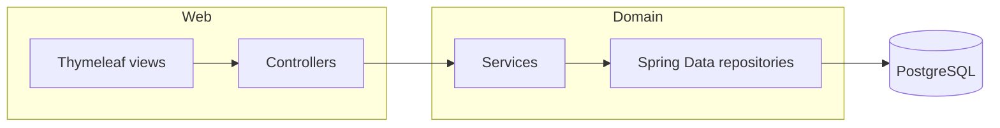

# 📚 Библиотека — Spring Data JPA

Учебное веб-приложение для учёта **читателей** и **книг**: выдача и возврат, поиск, пагинация и сортировка. Классический стек **Spring MVC** (без Boot), **Spring Data JPA**, **Hibernate**, **Thymeleaf**, **PostgreSQL**; тесты на **JUnit 5** и **H2**.

---

## Возможности

| Область | Что есть |
|--------|----------|
| **Люди** | Список, карточка с книгами на руках, создание, редактирование, удаление |
| **Книги** | Список, детальная страница, CRUD, **поиск по названию**, **пагинация** (`page`, `books_per_page`), **сортировка по году** |
| **Выдача** | Назначение книги читателю, возврат (`assign` / `release`) |
| **Качество** | Bean Validation на сущностях, глобальный обработчик ошибок, юнит-тесты сервисов, репозиториев и контроллеров |

---

## Стек

- Java, Maven (`packaging: war`)
- Spring Framework 5.3 · Spring Data JPA 2.4 · Spring MVC
- Hibernate 5 · HikariCP
- Thymeleaf (Spring5)
- PostgreSQL (прод/разработка) · H2 (тесты)
- JUnit Jupiter · Mockito · Hamcrest

---

## Архитектура (кратко)



Маршруты в основном под префиксами `/people` и `/books` (см. `PeopleController`, `BookController`).

---

## Требования

- JDK 8+ (совместимо с версией Spring в проекте)
- Для **`make`** целей Maven подтягивается через **`./mvnw`** (отдельно ставить Maven не обязательно). При желании можно использовать системный Maven 3.6+ (`make MVN=mvn package`).
- PostgreSQL с базой данных (по умолчанию имя БД — `library`, см. пример конфигурации ниже)
- Сервер приложений с поддержкой Servlet API 4 (например, Apache Tomcat 9+) для деплоя **WAR**

---

## Настройка базы данных

1. Создайте БД, например:

   ```sql
   CREATE DATABASE library;
   ```

2. Скопируйте пример свойств и подставьте свои значения:

   ```bash
   cp src/main/resources/hibernate.properties.example src/main/resources/hibernate.properties
   ```

   Пароль можно не дублировать в файле: если `hibernate.connection.password` пустой или отсутствует, приложение возьмёт его из переменной окружения **`LIBRARY_DB_PASSWORD`** (см. `SpringConfig#dataSource`).

3. Убедитесь, что в `hibernate.properties` указаны корректные `hibernate.connection.url`, `username`, при необходимости `password` (или задайте только `LIBRARY_DB_PASSWORD`), а также `hibernate.dialect` для PostgreSQL.

Схема БД синхронизируется с сущностями через **`hibernate.hbm2ddl.auto`** (в примере и в `SpringConfig` это значение читается из `hibernate.properties`). По умолчанию в репозитории задано **`update`**: Hibernate создаёт отсутствующие таблицы и добавляет новые колонки/ограничения, но не удаляет «лишние» объекты схемы. Для продакшена чаще выбирают **`validate`** или отключают авто-DDL и ведут схему через миграции.

<details>
<summary><strong>Пример DDL для PostgreSQL</strong> (если настраиваете схему вручную или для справки)</summary>

```sql
CREATE TABLE person (
  person_id SERIAL PRIMARY KEY,
  name VARCHAR(255) NOT NULL,
  surname VARCHAR(255) NOT NULL,
  age INTEGER NOT NULL,
  email VARCHAR(255) NOT NULL,
  address VARCHAR(255),
  date_of_birth DATE
);

CREATE TABLE book (
  book_id SERIAL PRIMARY KEY,
  book_name VARCHAR(255) NOT NULL,
  author VARCHAR(255) NOT NULL,
  year_published INTEGER NOT NULL,
  taken_at TIMESTAMP,
  person_id INTEGER REFERENCES person (person_id)
);
```

</details>

---

## Сборка и тесты

```bash
# Сборка WAR (Maven Wrapper из репозитория)
./mvnw clean package

# Только тесты
./mvnw test
```

Через **Makefile** по умолчанию вызывается **`./mvnw`** (системный `mvn` не нужен). На Windows: `make MVN=mvnw.cmd package`.

| Команда | Действие |
|---------|----------|
| `make package` | Сборка `target/com.springDataJPA.library.war` |
| `make test` | Запуск тестов |
| `make clean` | Очистка `target/` |
| `make skip-tests` | Сборка без тестов (-DskipTests) |

После успешной сборки артефакт: **`target/com.springDataJPA.library.war`** — разверните его в Tomcat (или другом контейнере) и откройте приложение по контексту, заданному при деплое.

### Запуск в IntelliJ IDEA (Tomcat, локально)

**Перед настройкой**

- Установлен **Tomcat 9+** (или другой контейнер с **Servlet 4**), известен путь к каталогу установки.
- В проекте задан **JDK**: *File → Project Structure → Project SDK*.
- Есть рабочий **`hibernate.properties`** с доступом к PostgreSQL (или пароль через **`LIBRARY_DB_PASSWORD`**), иначе Spring-контекст не поднимется.

**1. Подключить Tomcat к IDE**

1. *File → Settings* (Windows/Linux) или *IntelliJ IDEA → Settings* (macOS).
2. *Build, Execution, Deployment → Application Servers*.
3. **+** → **Tomcat Server**, укажите **Tomcat Home** (корень установки Tomcat).
4. **OK**.

**2. Создать конфигурацию запуска**

1. *Run → Edit Configurations…*
2. **+** → **Tomcat Server → Local** (не Remote).
3. Вкладка **Server** (в новых версиях может называться **Configuration**):
   - **Application server** — выберите добавленный Tomcat;
   - **HTTP port** — обычно **8080** (понадобится для URL);
   - по желанию включите **Update classes and resources** (удобно вместе с *war exploded*).

**3. Добавить артефакт деплоя**

1. Вкладка **Deployment**.
2. **+** → **Artifact**:
   - **`com.springDataJPA.library:war exploded`** — удобнее для разработки (быстрее пересборка, подхват классов/ресурсов);
   - **`com.springDataJPA.library:war`** — один WAR, ближе к продакшену.
3. Если артефакта нет в списке: *File → Project Structure → Artifacts* — добавьте **Web Application: Exploded** или **Archive** из Maven-модуля с `packaging war`; либо выполните **`package`** в Maven-панели — IDEA часто подхватывает артефакт после импорта проекта.

**4. Application context (префикс URL)**

В блоке **Deploy at the server startup** у выбранного артефакта задайте **Application context**, например:

- **`/com.springDataJPA.library`** — как при деплое файла `com.springDataJPA.library.war` в отдельном Tomcat;
- **`/`** — приложение в корне сервера (аналог `ROOT.war`).

**Apply → OK**.

**5. Запуск**

Выберите созданную конфигурацию Tomcat в тулбаре Run, нажмите **Run** (▶) или **Debug** и дождитесь успешного старта сервера в консоли.

**6. Открыть сайт**

Базовый адрес: **`http://localhost:<порт><Application context>`**. При порте **8080** и контексте **`/com.springDataJPA.library`**:

- `http://localhost:8080/com.springDataJPA.library/people`
- `http://localhost:8080/com.springDataJPA.library/books`

При контексте **`/`**:

- `http://localhost:8080/people`
- `http://localhost:8080/books`

**Частые проблемы**

| Симптом | Что проверить |
|--------|----------------|
| Порт занят | Другой HTTP port в настройках Tomcat или освободить **8080**. |
| **404** | Совпадает ли **Application context** с путём в адресной строке. |
| Ошибки Spring / БД | Консоль Tomcat: URL БД, пароль, запущен ли PostgreSQL. |

---

## Полезные URL (после деплоя)

| Путь | Описание |
|------|----------|
| `/people` | Список читателей |
| `/people/new` | Новый читатель |
| `/books` | Список книг; опционально `?page=1&books_per_page=10&sort_by_year=true` |
| `/books/search` | Поиск по названию |
| `/books/new` | Новая книга |

---

## Структура проекта (выжимка)

```
src/main/java/com/springDataJPA/library/
├── config/          # Spring / JPA / MVC
├── controllers/     # PeopleController, BookController
├── services/
├── repositories/    # Spring Data JPA
├── models/          # Person, Book
└── exception/       # ResourceNotFoundException, GlobalExceptionHandler

src/main/webapp/WEB-INF/views/
├── people/
└── books/

src/test/java/       # тесты с TestJpaConfig и H2
```

---

## Лицензия

Проект учебный; при публикации добавьте выбранную лицензию при необходимости.
